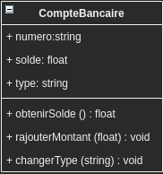

- [1. Classes et Objets](#1-classes-et-objets)
  - [Exercices](#exercices)
- [2. Déclaration d'une Classe de base](#2-déclaration-dune-classe-de-base)
- [3. Création des objets: Instanciation](#3-création-des-objets-instanciation)
  - [3.1. Accès aux propriétés d'un objet](#31-accès-aux-propriétés-dun-objet)
  - [3.2. Création des méthodes de la classe](#32-création-des-méthodes-de-la-classe)
  - [Exercices](#exercices-1)
- [4. Initialisation d'objets: le Constructeur](#4-initialisation-dobjets-le-constructeur)
  - [Exercices:](#exercices-2)
- [5. Héritage en PHP](#5-héritage-en-php)
  - [Implementation de l'héritage de base](#implementation-de-lhéritage-de-base)
    - [**1.** Création de la **superclasse**](#1-création-de-la-superclasse)
    - [**2.**  Créez les **sous-classes**](#2--créez-les-sous-classes)
  - [Exercices](#exercices-3)
- [6. Les classées abstraites et les Interfaces](#6-les-classées-abstraites-et-les-interfaces)
  - [Exercices](#exercices-4)
- [Annexe : Différence entre classe abstraite et interface (eng)](#annexe--différence-entre-classe-abstraite-et-interface-eng)
  - [Pourquoi utiliser des classes abstraites au lieu d'une classe normale?](#pourquoi-utiliser-des-classes-abstraites-au-lieu-dune-classe-normale)

<br>


# 1. Classes et Objets

**Classe** : représentation abstraite d'un **objet**. On peut dire
aussi un "modèle" pour créer des objets.

Une classe défini un ensemble de **propriétés** (= variables ou constantes) et un ensemble des **méthodes** (fonctions)
pour manipuler ces propriétés.

Une **classe est un type de données** (tel que string, integer, boolean, array...) dont la structure est définie par l'utilisateur (le developpeur !).

**Exemple:** une **classe** **CompteBancaire** contient les propriétés numero, solde, type... et les méthodes pour manipuler (accéder et modifier) ces propriétés (obtenirSolde(), rajouterMontant(), changerType()...)

<br>




<br>

La classe elle-même est juste un modèle à partir duquel on crée des **objets concrets**.

**Objet** : la concrétisation d'une classe

On crée les objets à partir d'un modèle.

**Exemple:** A partir du modèle CompteBancaire on crée des objets du type CompteBancaire : **$compte1, $compte2\....**. Chaque objet contient ses  propres valeurs pour chaque propriété de la classe :


**objet $compte1**

* **numero**  654-345345-455
* **solde**  1500,00
* **type** : « Crédit »

**objet $compte2**

* **numero** : 688-265366-455
* **solde** : 6500,00
* **type** : « Crédit »


On peut lire ou modifier les valeurs de ces propriétés grâce aux méthodes **obtenirSolde**(), **rajouterMontant**() et **changerType**(). On peut rajouter autant de méthodes qu'on veut... ça dépendra de la fonctionnalité qu'on veut donner à nos objets.


**Les attributs de la classe peuvent être manipulés uniquement par les méthodes de la classe (principe d'encapsulation)**.

Vu que la classe est un modèle, **on peut créer autant d'objets qu'on veut à partir de ce modèle** et ils seront indépendants (plusieurs comptes bancaires compte1, compte2 etc...). Chaque objet aura de valeurs
différentes pour ses attributs (l'attribut **numero** de **compte1** est 666-666666-666 et le **numero** de **compte2** 777-777777-777).

Les classes peuvent représenter des entités qu'on peut imaginer facilement comme de voitures, de maisons, des employés... mais aussi des entités plus abstraites voire une un fichier d'image, une connexion à une base de données, une position dans une carte, figure géométrique, un
bouton d'une interface graphique, un mouvement dans un jeu... il n'y a pas de limites.

<br>

## Exercices

<br>

* Considérez les propriétés et les méthodes qui pourraient
constituer les classes qu'on vient de mentionner

*  Quelles méthodes rajouteriez-vous dans la classe
CompteBancaire pour la rendre plus complète?

<br>

# 2. Déclaration d'une Classe de base


<br>

Une classe est constituée de ses **propriétés** (attributs) et ses **méthodes**. Pour la déclarer, on utilise le mot class suivi du nom de la classe (**Exemple:** Personne) et des accolades **{}.**

Voici la **déclaration** d'une classe Personne:

```php
class Personne {

    // ici les propriétés
    public string $nom;
    public string $prenom;

    // ici les méthodes (on n'a aucune pour le moment...)

}
```

    Note: ici on spécifiera le types des propriétés


Le code précédant devrait se trouver, par convention, dans un fichier qui porte le même nom que la classe suivi de « .class.php ». 

**Exemple: Personne.class.php**

On déclare toutes les propriétés et les méthodes entre les accolades.
Dans ce premier exemple on a uniquement crée deux propriétés $nom et $prenom, et aucune méthode. Pour créer une propriété de la classe **on doit uniquement lui donner un nom précédé du signe $**. C'est la même syntaxe que pour les variables en PHP. On rajoute le modificateur **public** dont on parlera après.


<br>

# 3. Création des objets: Instanciation

Une fois la classe est déclarée on peut l'**instancier. Instancier une classe c'est la même chose que créer des objets** **de la** classe.
Pour ce faire, on utilise l'opérateur new **suivi du nom de la
classe**. Comme pour tous les autres types de données, on doit stocker l'objet qu'on crée dans une variable (ex: $person1, $person2...)


    Note: Créez un fichier (ex: accueil.php) contenant le code suivant

```html
<!DOCTYPE html>
<html lang="en">

<head>
    <meta charset="UTF-8">
    <meta http-equiv="X-UA-Compatible" content="IE=edge">
    <meta name="viewport" content="width=device-width, initial-scale=1.0">
    <title>Document</title>
</head>

<body>
```
```php
    <?php

    include("./Personne.class.php");
    
    // Création d'un 1er objet Personne.
    // On le stocke dans la variable $person1
    $person1 = new Personne();

    // Création d'un 2éme objet Personne. 
    // On le stocke dans la variable $person2
    $person2 = new Personne();
    var_dump($person1); // afficher le contenu de l'objet
    var_dump($person2);

    ?>
```
```html
</body>
</html>
```

**var_dump** nous indique que $person1 est un **object** de la classe
**(Personne)**, le premier (**\#1**) qu'on a créé de la classe
Personne. Ses propriétés n'ont pas encore une valeur définie (**NULL**). Pour $person2 c'est pareil sauf qu'il s'agit du deuxième objet créé de la classe Personne. On va voir maintenant comment modifier ces propriétés.

<br>

## 3.1. Accès aux propriétés d'un objet

<br>

On a inclut le mot public devant les propriétés, ce qui nous permet
de les accéder (lire et modifier) dans le code qui se trouve en dehors de la classe.

Pour accéder aux éléments de la classe **depuis l'extérieur** de la
classe (soit une propriété ou une méthode) on utilise le nom de l'objet
suivi de l'opérateur **->** (c'est l'équivalent au **.** dans d'autres langages OO).


```php
// changer les propriétés de l'objet et l'afficher
$person1->nom="Vonnegut"; // modifier la propriété nom
$person1->prenom="Kurt"; // modifier la propriété prenom
echo $person1->nom; // lire la propriété, même syntaxe !
echo "<br>Le prenom est: ".$person1->prenom;
``` 


En accédant directement aux propriétés, on ne respecte pas le
**principe d'encapsulation**. Pour simplifier ce concept: **les propriétés de la classe devraient être accédées (lues ou modifiées, peu importe) uniquement par les méthodes de sa propre classe, pas par un code  principale ni par le code d'une autre classe**. Ce principe est **fondamental** dans la POO.

Pour que les propriétés (=attributs) soient accessibles uniquement depuis les méthodes qui se trouvent à l'intérieur de la classe vous devez changer le modificateur d'accès de public à **private**.

Si on ne peut pas accéder de directement aux propriétés en dehors de la classe... comment est-ce qu'on peut lire et modifier ses valeurs? **On doit créer des méthodes ("get" et "set") dans la classe pour lire/écrire les propriétés**.


## 3.2. Création des méthodes de la classe

Pour le moment on a une classe contenant uniquement de propriétés, mais on va avoir besoin d'avoir de méthodes pour les **lire/modifier**. Les méthodes se rajoutent dans la déclaration de la classe (juste après les propriétés ou juste avant).

**Une méthode est** une fonction qui appartient à la classe et qui manipule les propriétés de la classe** (lire ou modifier). Les méthodes reçoivent de paramètres et renvoient des résultats (return).
La syntaxe est pareille.

Créons une nouvelle classe **PersonneP**. Cette classe contient les méthodes pour lire/modifier la propriété « nom » de la
classe (**getter** et **setter**):

```php
<?php

class PersonneP {
    private string $prenom;
    private string $nom;

    public function getNom():string
    {
        return $this->nom;
    }

    public function setNom(string $nom):void
    {
        $this->nom = $nom;
    }
}

```

Note: certains developpeurs précedent les noms des membres privés d'un underscore, ce qu'on ne fera pas ici

Pour pouvoir accéder aux propriétés depuis l'intérieur de la classe on doit trouver la manière de référencer l'objet courant : **le mot clé $this**. **On l'utilise quand un objet veut accéder à ses propres propriétés depuis une méthode de la propre classe** (à l'interieur de
setNom et getNom, par exemple, ou dans une fonction qui affiche les
attributs d'un objet).

Dans les premiers exemples on avait accédé aux propriétés depuis un autre script

(ex: $person1->nom="Smith", echo $person2->nom...). Cette action
était possible car les propriétés étaient **publiques**, mais ici on va les
déclarer **privées** (**private**).

Maintenant qu'on a créé les méthodes qui accèdent aux propriétés
(méthodes get et set), on peut les utiliser depuis le code principal du
script même si elles sont privées. On doit juste utiliser la
syntaxe **$nomObjet->nomMethode() :**

```php
// getter et setter
$person1 = new PersonneP();
$person1->setNom("Connors");
echo "<br>Le nom de PersonneP : ".$person1->getNom();
// echo $person1->nom; // erreur!! La propriété est privée 
```

En utilisant **private** on indique que les propriétés sont accessibles uniquement depuis l'intérieur de la classe. Cela implique qu'on sera obligé d'utiliser les méthodes pour accéder aux propriétés. Ce code:

```php
$person1->nom="Connors";
```

Provoquera une erreur parce-que nom et prénom sont privées. On devra
faire:

$person1->setNom("Connors");

De façon analogue, les méthodes peuvent être public ou private. Par
défaut, les éléments d'une classe sont publiques, mais c'est une bonne
habitude de toujours spécifier le modificateur d'accès: public, private
ou protected.

<br>

## Exercices

<br>

1.  Créez une classe CompteBancaire qui contient les informations et les opérations basiques d'un compte bancaire. Il faut pouvoir obtenir le solde du compte, enlever et rajouter un montant d'argent. On peut aussi bloquer et débloquer le compte

2.  Pour la classe suivante PersonneP il nous manque les méthodes pour lire/modifier la propriété « prenom ». Créez-les et testez-les!

```php
<?php
class PersonneP {
    private string $prenom;
    private string $nom;

    public function getNom():string
    {
        return $this->nom;
    }

    public function setNom(string $nom):void
    {
        $this->nom = $nom;
    }
}
```


3.  Rajoutez une méthode afficher() dans la classe Personne qui affiche le texte suivant:

        "Je suis une personne et je m'appelle <prenom> <nom>!!"

4.  Rajoutez l'état civil à la classe précédant ainsi que les méthodes pour l'accéder

5.  On développe une application d'e-commerce et on veut représenter
    les produits en utilisant une classe. Les informations à stocker
    seront un code, le nom et le prix de chaque produit. Créez le code
    correspondant à cette classe Product (dans un autre fichier) et
    testez-la. En plus des fonctions de base (get et set), créez une
    autre pour afficher les infos d'un produit sur le site web.

6.  Rajoutez une méthode à la classe précédente capable d'obtenir le
    prix du produit TVAC. La méthode reçoit le taux de TVA

7.  Créez une classe Voiture pour représenter une voiture. Rajoutez
    les propriétés et les méthodes permettant de réaliser les fonctions
    basiques d'une voiture.

8.  Dans la classe Voiture, créez une méthode démarrer(). Dans le
    code de cette méthode on doit appeler une autre méthode
    preparerMoteur() aussi définie dans la classe mais pas accessible
    depuis l'extérieur.

Modifiez la classe Voiture pour qu'elle ne démarre pas si la
voiture n'a pas d'essence.

9.  Créez une classe Adresse contenant le nom de la rue, le numero et
    un code postal. Créez plusieurs objets adresse et une fonction pour
    afficher la totalité de l'adresse.

Quand on essaie d'assigner une rue à l'adresse, la méthode
correspondante doit vérifier qu'il n'y pas de chiffres dans la
valeur à assigner.

10.  Créez une classe qui représente un dé d'un jeu de rol. On choisit le nombre de faces du dé quand on le crée (il aura 6 faces par défaut)

11.  Modelisez **le personnage d'un jeu et ses actions** en
    utilisant une classe

12.  Créez une classe Cercle qui contient le rayon du cercle et son
    centre. Le centre est défini par deux cordonnées numériques

a)  Créez des méthodes get/set pour accéder les coordonnées et le
    rayon

b)  Créez des méthodes pour définir/obtenir le rayon et les
    coordonnées du centre du cercle

c)  Créez des méthodes pour calculer l'aire et la circonférence

d)  Créez une méthode pour afficher toutes les données concernant le
    cercle (centre, aire, circonférence...). Pour afficher le centre
    et le radio, utilisez les méthodes get au lieu d'accéder
    directement aux propriétés

1.   Créez une classe CercleA où le centre du cercle est un array de
    deux valeurs. Observez qu'on peut réutiliser pratiquement tout le
    code.

<br>

# 4. Initialisation d'objets: le Constructeur

<br>

Quand on instancie un objet on doit donner des valeurs à ses propriétés.
Pour le moment on l'a fait avec les méthodes **set** de chaque classe.
Ex:

```php
$a1= new address;
$a1->setNumber(90);
$a1->setPostalCode(1050);
```

Si on avait une liste de 10 propriétés on aurait 10 lignes de code juste
pour l'initialisation d'un objet, c'est completement absurde. En plus on pourrait oublier d'initialiser des propriétés et avoir des problèmes plus tard!.

Le **constructeur** (méthode "magique" **__construct()** dans la classe) nous permet de donner des **valeurs aux proprietés d'un objet lors sa création**. Cette fonction est appelée **automatiquement** chaque fois qu'on crée un objet de la classe où on l'a déclaré.

Créons à nouveau la classe Personne, cette fois avec un constructeur (PersonneC):


```php
<?php


class PersonneC {
    private string $prenom;
    private string $nom;


    public function __construct (string $prenom, string $nom){
        $this->prenom = $prenom;
        $this->nom = $nom;
    }


    /**
     * Obtenir la valeur de nom
     */ 
    public function getNom():string
    {
        return $this->nom;
    }

    /**
     * Modifier la valeur de nom
     *
     * @return  self
     */ 
    public function setNom(string $nom)
    {
        $this->nom = $nom;

        return $this;
    }

    /**
     * Get the value of prenom
     */ 
    public function getPrenom()
    {
        return $this->prenom;
    }

    /**
     * Set the value of prenom
     *
     * @return  self
     */ 
    public function setPrenom($prenom)
    {
        $this->prenom = $prenom;

        return $this;
    }
}

```

On peut l'utiliser dans un autre script. On s'epargne les lignes des set... et imaginez l'utilité du constructeur si on avait plein de propriétés au lieu de deux!


```php
// constructeur
$person1 = new PersonneC("María" , "Delangre");
echo "<br>Le prénom de PersonneC : " . $person1->getPrenom();
echo "<br>Le nom de PersonneC : " . $person1->getNom();
```

À partir de PHP8 on peut utiliser une nouvelle syntaxe dans la classe pour créer le constructeur, ce qui nous epargne encore plus du code :

    Note: pour le moment Intelephense affiche une erreur si on utilise cette syntaxe, mais une tel erreur n'existe pas. Attendons que les devs le corrigent dans une prochaine version

```php 
<?php


class PersonneC2 {
    
    public function __construct (private string $prenom, private string $nom){

    }

    /**
     * Obtenir la valeur de nom
     */ 
    public function getNom():string
    {
        return $this->nom;
    }

    /**
     * Modifier la valeur de nom
     *
     * @return  self
     */ 
    public function setNom(string $nom)
    {
        $this->nom = $nom;

        return $this;
    }

    /**
     * Get the value of prenom
     */ 
    public function getPrenom()
    {
        return $this->prenom;
    }

    /**
     * Set the value of prenom
     *
     * @return  self
     */ 
    public function setPrenom($prenom)
    {
        $this->prenom = $prenom;

        return $this;
    }
}
``` 


<br>


## Exercices:

<br>

1.  Créez une classe Contact pour représenter un contact dans le
    répertoire d'un smartphone

2.  Créez une classe Image pour représenter une image et ses
    attributs de HTML (src, alt...). Cette classe a une méthode
    afficher() qui s'occupera de générer le HTML qui affichera l'image
    dans le navigateur

3.  Créez une classe Série pour représenter une série de TV. A part
    des attributs de base de la série la classe doit contenir une liste
    des acteurs qui jouent dans la série.

4.  Créez une classe Recette qui représente une recette de cuisine.
    Une recette doit avoir un nom, une description et une liste d'un
    nombre indéfini de couples ingrédient-quantité. Pour stocker la
    liste d'ingrédients on va utiliser un array simple.

Vous devez créer un constructeur qui reçoit uniquement le nom de la
recette. Créez les méthodes nécessaires pour rajouter des ingrédients
un par un à la recette. Créez une méthode pour afficher la liste
d'ingrédients.


5.  Créez une classe Triangle qui contient les trois sommets d'un
    triangle (trois couples de cordonnées (x,y)) ainsi que la couleur de
    remplissage. On peut afficher les trois cordonnées et "déplacer"
    le triangle. Les coordonnés son créés à l'extérieur de la
    classe.


<br>

# 5. Héritage en PHP

<br>

L'héritage est un des grands principes de la programmation orientée
objet, et PHP l'implémente dans son modèle objet. Ce principe va
**affecter la manière dont de nombreuses classes sont en relation les unes avec les autres**.

Par exemple, lorsque vous étendez une classe, la classe **fille hérite de toutes les méthodes publiques et protégées (protected) de la classe mère**.


**Exemple:** Considérons une classe pour représenter un lecteur de DVD
```php
<?php
class LecteurDVD {
    public string $marque;
    public string $vitesseLecture;

    public function __construct(string $marque, int $vitesseLecture)
    {
        $this->marque = $marque;
        $this->vitesseLecture = $vitesseLecture;
    }
    public function lireDVD (){
        echo "<br>On lit le DVD....";
    }
}

```

Considérons maintenant une classe capable de représenter un appareil de
DVD capable d'enregistrer, c.a.d. un lecteur-graveur:

```php
<?php
class LecteurGraveurDVD {
    public string $marque;
    public string $vitesseLecture;
    public string $vitesseEnregistrement;

    public function __construct(string $marque, int $vitesseLecture, int $vitesseEnregistrement)
    {
        $this->marque = $marque;
        $this->vitesseLecture = $vitesseLecture;
        $this->vitesseEnregistrement = $vitesseEnregistrement;
    }

    public function lireDVD (){
        echo "<br>On lit le DVD....";
    }
    public function enregistrerDVD (){
        echo "<br>On enregistre un DVD....";

    }
}
```

    Note: nous avons mis les attributs en public pour simplifier la classe,
mais ils devraient être privés

Testez les classes en utilisant ce script (accueilSansHeritage.php):

```html
<!DOCTYPE html>
<html lang="en">

<head>
    <meta charset="UTF-8">
    <meta http-equiv="X-UA-Compatible" content="IE=edge">
    <meta name="viewport" content="width=device-width, initial-scale=1.0">
    <title>Document</title>
</head>

<body>
```
```php
    <?php
    
        include "./LecteurDVD.class.php";
        include "./LecteurGraveurDVD.class.php";
        $l1 = new LecteurDVD("Hitachi",600);
        $e1 = new LecteurGraveurDVD("Sony",600,400);
        $l1->lireDVD();
        $e1->lireDVD();
        $e1->enregistrerDVD();
        var_dump($l1);
        var_dump($e1);

    ?>
```
```html
</body>
</html>
```

Cette nouvelle classe est identique à lecteurDVD sauf pour un attribut
**$vitesseEnregistrement** et la méthode **enregistrer()**. C'est une
répétition inutile du code qu'on peut éviter en utilisant **l'héritage**. 

On peut dire que les classes LecteurDVD et
LecterGraveurDVD sont des **spécialisations d'une classe de base** 
**AppareilDVD**. Elles doivent posseder tout le contenu de la classe de base et, eventuellement, d'autres propriétés (vitesse d'enregistrement) et des méthodes (enregistrer()) en plus.

**L'héritage permet à une ou plusieurs classe (sous-classes) d'hériter tous les attributs et méthodes d'une autre classe (la "superclasse").**

On dit **qu'un objet de la sous-classe est un objet de la
superclasse, mais pas à l'inverse** (ex: tous les LecteurGraveurDVD
sont des AppareilsDVD mais pas tous les AppareilsDVD sont de
LecteurGraveursDVD...)

**Comment réaliser** l'héritage entre les classes?


## Implementation de l'héritage de base

<br>

### **1.** Création de la **superclasse** 

(**AppareilDVD** dans ce cas)

<br>

**IMPORTANT:** Cette classe contient un constructeur **pour initialiser les propriétés communes** à toutes les sous-classes

<br>


```php
<?php

class AppareilDVD
{
    public $marque;
    public $vitesseLecture;

    public function __construct(string $marque, int $vitesseLecture)
    {
        $this->marque = $marque;
        $this->vitesseLecture = $vitesseLecture;
    }
    public function lireDVD()
    {
        echo "<br>On lit le DVD....";
    }
}
```

<br>

### **2.**  Créez les **sous-classes** 

("LecteurDVDH" et "LecteurGraveurDVDH")

<br>

Ces classes contiennent uniquement les propriétés et méthodes particulières à chacune (**vitesseEnregistrement** et **enregistrer()** dans LecteurGraveurDVDH)

Indiquez (en utilisant le mot clé **extend**) que **les sous-classe
dérivent (héritent) d'une superclasse** à notre choix.

```php
<?php
// fichier LecteurDVDH.class.php
include_once "./AppareilDVD.class.php";

class LecteurDVDH extends AppareilDVD {
    public function __construct (string $marque, int $vitesseLecture){
        parent::__construct ($marque, $vitesseLecture);

    }
}
```

```php
<?php
// fichier LecteurGraveurDVDH.class.php
include_once "./AppareilDVD.class.php";

class LecteurGraveurDVDH extends AppareilDVD {
    public int $vitesseEnregistrement;

    public function __construct(string $marque, 
                                int $vitesseLecture, 
                                int $vitesseEnregistrement)
    {
        parent::__construct ($marque, $vitesseLecture);
        $this->vitesseEnregistrement = $vitesseEnregistrement;
    }

    public function enregistrerDVD (){
        echo "<br>On enregistre un DVD....";

    }
}

```


Quelles sont les **conséquences**?

1.  Tous les objets de la sous-classe **contiennent tous les attributs et méthodes publiques et protected** de la superclasse. Pas les méthodes **privés**

2.  Le constructeur de la sous-classe doit prendre en charge
    l'initialisation de ses propres attributs (**parent::**). Pour les attributs hérités, **la sous-classe doit appeler au constructeur de la superclasse**

3.  La superclasse **reste** **intacte**, les sous-classes incluent le mot **extends** dans leur déclaration (voir code)

Nous avons gagné en simplicité et cohésion. Si la superclasse change, la sous-classe changera aussi car qu'elle hérite de la superclasse.

Testez le code avec le script accueilAvecHeritage.php :

```php
<!DOCTYPE html>
<html lang="en">

<head>
    <meta charset="UTF-8">
    <meta http-equiv="X-UA-Compatible" content="IE=edge">
    <meta name="viewport" content="width=device-width, initial-scale=1.0">
    <title>Document</title>
</head>

<body>
```
```php
    <?php
    
        include "./LecteurDVDH.class.php";
        include "./LecteurGraveurDVDH.class.php";
        $l1 = new LecteurDVDH("Hitachi",600);
        $e1 = new LecteurGraveurDVDH("Sony",600,400);
        $l1->lireDVD();
        $e1->lireDVD();
        $e1->enregistrerDVD();
        var_dump($l1);
        var_dump($e1);

    ?>
```
```html
</body>

</html>
```


Au lieu d'utiliser public, on aurait pu déclarer les attributs **protected** (protégés). Ça a exactement le même effet que les déclarer private, mais un attribut/méthode protected sera hérité et un
private ne le sera pas. L'avantage de déclarer protected est d'empêcher aux autres programmeurs d'accéder aux propriétés de notre classe directement.


<br>

Exercices
---

<br>

1.  Créez les classes Chien et Chat. Créez un ensemble de propriétés et
    méthodes à votre choix pour chaque classe. Trouvez une classe plus
    générale contenant tous les propriétés communes à ces deux classes
    et utilisez l'héritage pour éviter la duplication du code.

2.  Créez les classes Camion, Moto et Bus. Créez un ensemble de
    propriétés et méthodes à votre choix. Utilisez l'héritage pour
    éviter la duplication du code.

3.  Créez les classes correspondant à un Employé et un Manager. Les
    managers sont comme les employés mais ils ont responsables d'un
    département. On peut augmenter le salaire de tous les deux. Quand on l'augmente, un message s'affiche et nous indique s'il s'agit
    d'un employé ou d'un Manager.

4.  Modifiez la classe AppareilDVD pour rendre ses attributs protected.
    Vous allez avoir une erreur si vous exécutez le même code du script
    principal (manque d'accès). Créez les getters et les setters
    nécessaires pour pouvoir les accéder depuis le script principal.

5.  Créez une classe compteBancaire et une classe compteEpargne.
    Utilisez l'héritage pour ameliorer votre code


<br>


# 6. Les classées abstraites et les Interfaces

Une **classe abstraite** est une classe qui possède au moins une méthode qui n'est pas implémentée.

On **ne peut pas créer d'objets d'une classe abstraite**, mais **on peut créer des objets des classes qui héritent d'elle**

Une interface spécifie un ensemble de méthodes qui doivent être
implémentées par de classes. Une **interface crée un contrat** entre les classes mais pas l'état des objets. Similaire dans son structure à une classe abstraite mais elle n'implémente rien

**Exemple d'utilisation des interfaces** au sein d'un groupe de
développeurs on doit créer chacun une classe, mais toutes ces classes
doivent implémenter un ensemble de méthodes. On crée alors une
interface. Chaque nouvelle classe crée doit **implémenter** les mêmes
méthodes, définies dans l'interface mais pas implémentées dans
l'interface. Ils peuvent bien sûr rajouter leur propre contenu à leurs
classes

**Exemple d'utilisation d'une classe abstraite:** on pourrait se
trouver dans la situation precedante, mais cette fois une partie de la
classe (abstraite) est déjà implémentée. Les nouvelles classes
**héritent** de cette classe abstraite

Un **classe peut implémenter autant d'interfaces qu'on veut**, mais
hériter uniquement d'une classe. Une classe peut hériter d'une classe
mais implementer plein d'interfaces

Une classe abstraite peut avoir de variables comme propriétés mais une
interface peut avoir uniquément de constantes

<br>


Exercices
---

<br>


1.  Nous voulons développer un jeu où on a de véhicules. Nous avons : de camions, de voitures, d'avions, d'ultralégers et de véhicules amphibies. Les véhicules sont divisés en roulants, volants et flottants. Modélisez le système et créez les classes en utilisant des interfaces

2.  Nous avons besoin de créer un modèle pour un ensemble d'instruments
    de musique. Tous les instruments peuvent être joués. Il y a des
    instruments de percussion, à corde et à vent. Les instruments à vent
    peuvent être en bois ou en metal

3.  Vous êtes en train de créer un jeu. Vous avez plusieurs types de
    caractères : les magiciens, les épéistes et les voleurs. Chaque type
    a ses particularités : les magiciens lancent de sorts et sont
    capables de méditer, les épéistes peuvent se battre à l'épée et les
    voleurs peuvent s'infiltrer dans un groupe. Malheureusement les
    magiciens ne savent pas se battre autrement qu'on lançant de sorts.

Les guerriers et les voleurs sont des héros d'action : ils doivent
pouvoir aussi lutter avec ses mains (le magicien ne peut pas)

4.  Créez une nouvelle version de votre code en considérant qu'il
    existe un nouveau type de personnage (GuerrierSorcier) qui a toutes
    les habilités d'un guerrier en plus de pouvoir lancer de sorts. Il
    ne sait pas méditer.

5.  Implémentez l'interface ArrayAccess dans la classe Repertoire

http://php.net/manual/fr/class.arrayaccess.php>

Observez l'exemple ci-dessous. Notre objectif est de pouvoir accéder aux contacts de l'Repertoire comment s'il s'agissait d'un array :


```php
$repertoire= new Repertoire();
// rajouter un contact à le repertoire, au lieu de créer une fonction
// $a->rajouterContact()
$a[]= new Contact("Johnny"); 
$a[2]= new Contact("Michael"); 
$a[0]->afficher(); 
$a[2]->afficher(); 
if (isset($a[0])){
echo "<br>Il y a un objet dans l'index 0";
unset ($a[0]);
```

<br>

# Annexe : Différence entre classe abstraite et interface (eng)

Just one more time, in the simplest terms possible:

An Interface is like a protocol. It doesn't designate the behavior of
the object; it designates how your code tells that object to act. An
interface would be like the English Language: defining an interface
defines how your code communicates with any object implementing that
interface.

An interface is always an agreement or a promise. When a class says "I
implement interface Y", it is saying "I promise to have the same
public methods that any object with interface Y has".

On the other hand, an Abstract Class is like a partially built class. It is much like a document with blanks to fill in. It might be using
English, but that isn't as important as the fact that some of the
document is already written.

An abstract class is the foundation for another object. When a class
says "I extend abstract class Y", it is saying "I use some methods or
properties already defined in this other class named Y".

So, consider the following PHP:

<?php
class X implements Y { } // this is saying that "X" agrees to speak
language "Y" with your code.

class X extends Y { } // this is saying that "X" is going to complete
the partial class "Y".
?>

You would have your class implement a particular interface if you were
distributing a class to be used by other people. The interface is an
agreement to have a specific set of public methods for your class.

You would have your class extend an abstract class if you (or someone
else) wrote a class that already had some methods written that you want
to use in your new class.

These concepts, while easy to confuse, are specifically different and
distinct. For all intents and purposes, if you're the only user of any
of your classes, you don't need to implement interfaces.

Pourquoi utiliser des classes abstraites au lieu d'une classe normale?
-----------------------------------------------------------------------

Here's an example that helped me with understanding abstract classes.
It's just a very simple way of explaining it (in my opinion). Lets say
we have the following code:

<?php
class Fruit {
    private $color;
   
    public function eat() {
        //chew
    }
   
    public function setColor($c) {
        $this->color = $c;
    }
}

class Apple extends Fruit {
    public function eat() {
        //chew until core
    }
}

class Orange extends Fruit {
    public function eat() {
        //peel
        //chew
    }
}
?>

Now I give you an apple and you eat it.

<?php
$apple = new Apple();
$apple->eat();
?>

What does it taste like? It tastes like an apple. Now I give you a
fruit.

<?php
$fruit = new Fruit();
$fruit->eat();
?>

What does that taste like??? Well, it doesn't make much sense, so you
shouldn't be able to do that. This is accomplished by making the Fruit
class abstract as well as the eat method inside of it.

<?php

abstract class Fruit {
    private $color;
   
    abstract public function eat();
   
    public function setColor($c) {
        $this->color = $c;
    }
}
?>

Now just think about a Database class where MySQL and PostgreSQL extend
it. Also, a note. An abstract class is just like an interface, but you
can define methods in an abstract class whereas in an interface they are
all abstract.

(documentation de php: l'auteur est Alexios Tsiaparas)
